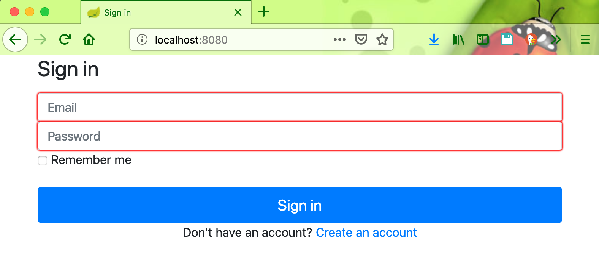
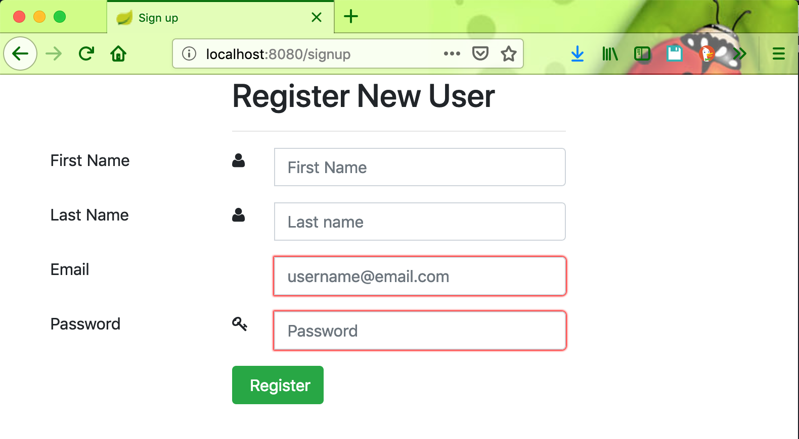
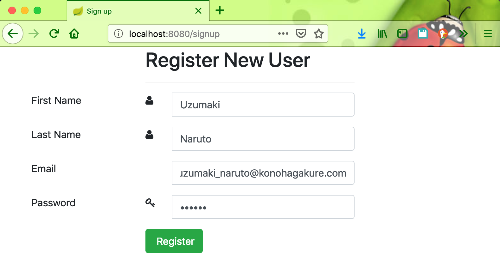
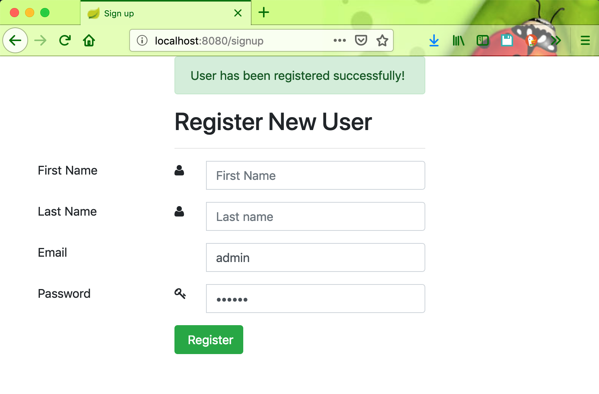
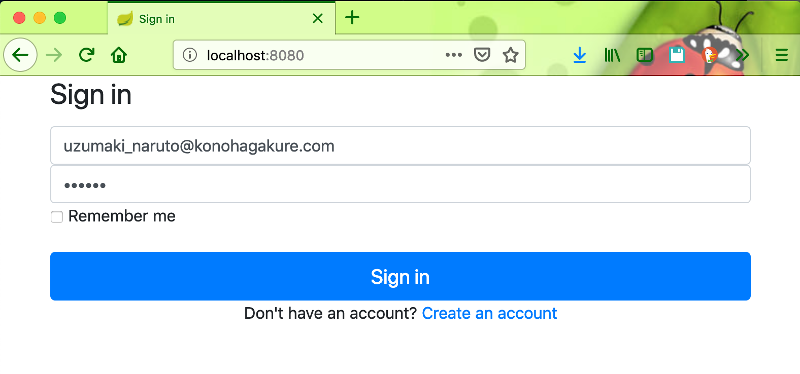

# springboot-account-registration

### Things to do to run the application

#### Clone the repository
```
git clone https://github.com/hendisantika/springboot-account-registration.git
```

#### Go the the folder 
```
cd springboot-account-registration
``` 

#### Run the application
```
mvn clean spring-boot:run
```

### Screen shot

#### Login Page



#### Register Account








#### Login Page



